# AnyGraspNet 数据集可视化探索

这个目录保存 AnyGraspNet 复现过程中的数据集可视化代码、说明文档和单场景示例输出。目标不是做一个通用可视化库，而是把训练数据从“文件夹和数组”解释成可以汇报的图：图像、深度、分割、点云、位姿、2D 抓取矩形、3D 抓取标签、碰撞过滤和对踵分析。

当前所有示例都围绕同一个样例展开，方便逐步对齐不同数据文件之间的关系。

```text
数据根目录: /home/zky-miakho/datas
样例场景: train_1/scene_0000/kinect/0000
默认物体: grasp_label/014_labels.npz，对应 014_peach
输出目录: visualization/outputs/scene_0000_kinect_0000/
```

> 注意：仓库只保存可视化代码、说明和少量示例输出，不保存完整数据集。

## 快速运行

在仓库根目录运行：

```bash
make vis-rgb
make vis-depth
make vis-rgb-depth
make vis-label
make vis-pointcloud
make vis-annotations
make vis-pose-axes
make vis-rect-labels
make vis-grasp-label
make vis-topk-3d-grasps
make vis-collision-label
make vis-antipodal
```

运行全部可视化测试：

```bash
make test-vis
```

常用变量可以在命令后覆盖：

```bash
make vis-rgb SCENE=scene_0001 FRAME=0010
make vis-grasp-label GRASP_OBJECT_ID=14
make vis-topk-3d-grasps GRASP_TOPK_PER_OBJECT=1
```

## 数据集结构总览

当前用到的数据大致分成五类：

```text
/home/zky-miakho/datas/
├── train_1/
│   └── scene_0000/kinect/
│       ├── rgb/              # 彩色图像
│       ├── depth/            # 16-bit 深度图
│       ├── label/            # 每像素物体实例 id
│       ├── meta/             # 单帧元数据，本轮只做说明
│       ├── annotations/      # 每帧物体 6D 位姿 XML
│       ├── camK.npy          # 相机内参
│       └── camera_poses.npy  # 每帧相机位姿
├── rect_labels/              # 场景帧级 2D 抓取矩形
├── grasp_label/              # 物体级 3D 抓取标签
├── collision_label/          # 场景级碰撞过滤标签
└── models-xt19/models/       # 物体 CAD/点云模型
```

理解顺序可以按这条线走：

```text
RGB / Depth / Label
-> RGB-D 点云
-> annotations 物体位姿
-> rect_labels 2D 抓取矩形
-> grasp_label 物体级 3D 抓取候选
-> Top-K 3D 抓取投影到 RGB
-> collision_label 场景级碰撞过滤
-> 对踵分析解释稳定抓取几何
```

## 1. RGB 原图：先确认场景

RGB 图是最直观的入口，用来确认相机视角、桌面、物体数量和遮挡关系。当前样例文件是：

```text
/home/zky-miakho/datas/train_1/scene_0000/kinect/rgb/0000.png
```

生成命令：

```bash
make vis-rgb
```

输出图：

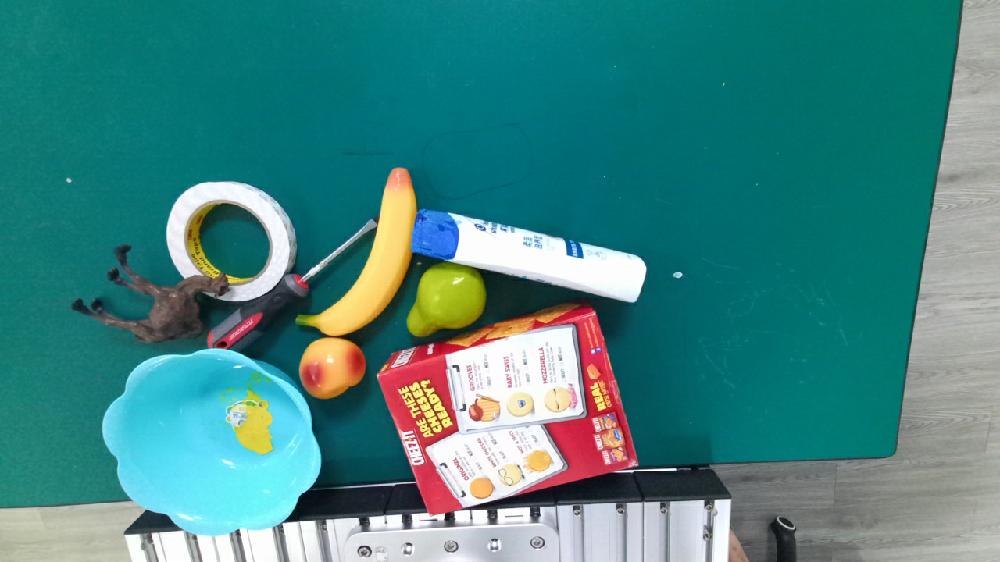

这张图后续会作为 2D 标签叠加、姿态轴投影、Top-K 抓取投影和碰撞过滤前后对比的背景。

## 2. Depth 深度图：从图像走向三维

深度图记录每个像素到相机的距离。原始文件是 16-bit PNG，直接看不直观，因此输出两种可视化：

```text
/home/zky-miakho/datas/train_1/scene_0000/kinect/depth/0000.png
```

生成命令：

```bash
make vis-depth
```

`depth_colormap.png` 使用 `viridis` 伪彩色，适合观察物体和桌面的距离变化：

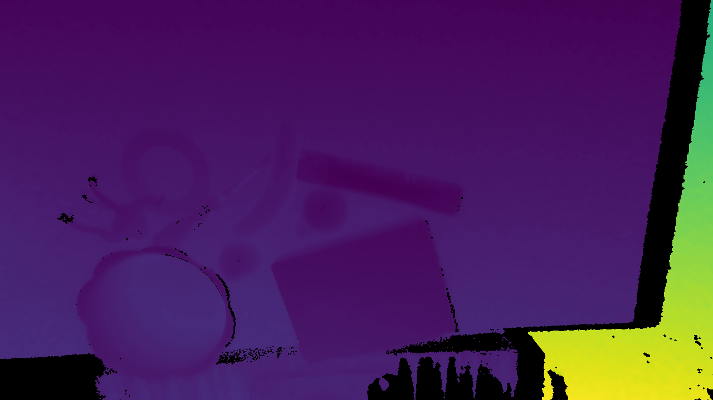

`depth_hamilton_colormap.png` 使用 RGB 立方体 Hamilton path 编码：

```text
black -> red -> yellow -> green -> cyan -> blue -> magenta -> white
```

相邻段只改变一个 RGB 通道，更适合讲清楚“深度数值如何映射成颜色”。黑色仍然保留给无效深度。

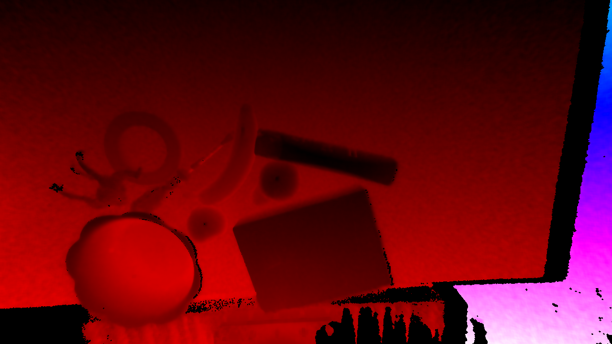

为了汇报时更容易连接 RGB 和 depth，额外生成左右并列图：

```bash
make vis-rgb-depth
```

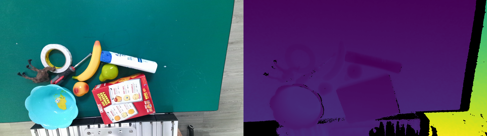

## 3. Label 分割标签：知道每个像素属于哪个物体

`label/` 是每像素实例 id 图。`0` 表示背景，非零值表示物体区域。当前样例文件是：

```text
/home/zky-miakho/datas/train_1/scene_0000/kinect/label/0000.png
```

生成命令：

```bash
make vis-label
```

输出图把 label 颜色化后半透明叠加到 RGB 上：

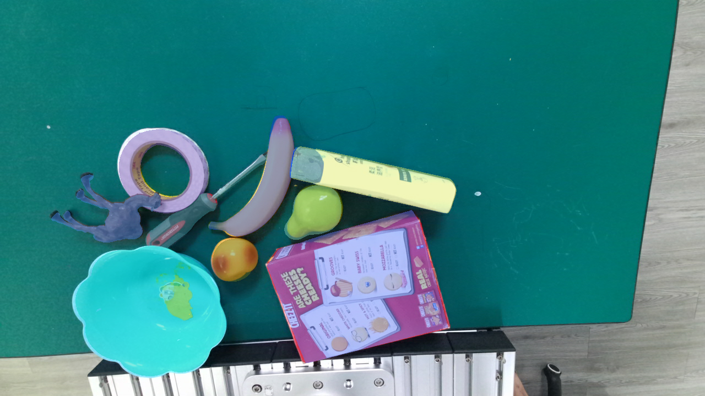

这里有一个容易混淆的偏移关系：`annotations/` 和 `grasp_label/` 使用 `obj_id`，但当前 label 图中物体像素通常对应 `obj_id + 1`。例如香蕉 `obj_id=5`，在 label 图中对应值 `6`。后面 Top-K 抓取可见点优先逻辑会用到这个关系。

## 4. RGB-D 点云：把二维图反投影到三维

RGB-D 点云由 RGB、depth 和 `camK.npy` 相机内参共同生成。脚本默认结合 `label/` 过滤背景，只保留前景物体点，并做轻微边缘腐蚀和深度裁剪，减少边缘离群点。

生成命令：

```bash
make vis-pointcloud
```

输出包括可打开的 PLY 文件和静态三视图预览：

```text
outputs/scene_0000_kinect_0000/pointcloud_rgb.ply
outputs/scene_0000_kinect_0000/pointcloud_preview.png
```

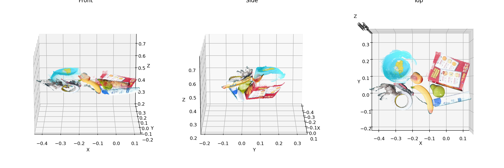

这一步的作用是建立三维直觉：RGB 图只是二维投影，depth 和相机内参可以把图像点恢复到相机坐标系中的空间点。

## 5. Annotations：物体 6D 位姿标注

`annotations/0000.xml` 保存当前帧每个物体的 6D 位姿。主要字段包括：

```text
obj_id        # 物体 id
obj_name      # 物体模型名称
obj_path      # 物体模型路径
pos_in_world  # 世界坐标系位置 x/y/z
ori_in_world  # 世界坐标系朝向 qx/qy/qz/qw
```

生成命令：

```bash
make vis-annotations
make vis-pose-axes
```

位姿轴叠加图把每个物体的局部坐标轴投影回 RGB：红色为局部 X 轴，绿色为局部 Y 轴，蓝色为局部 Z 轴，白色圆点为标注中心。

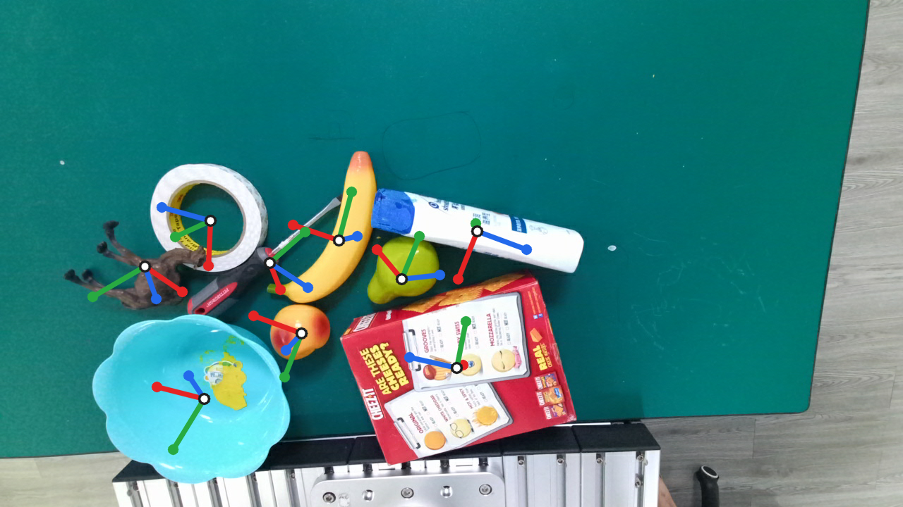

表格列出每个物体的 id、名称、位置和四元数：

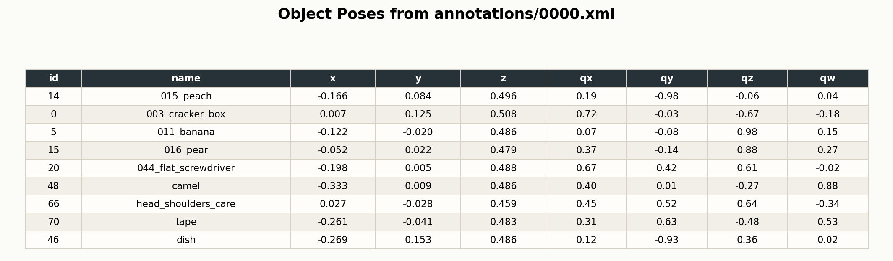

俯视图展示物体在桌面平面上的空间分布：

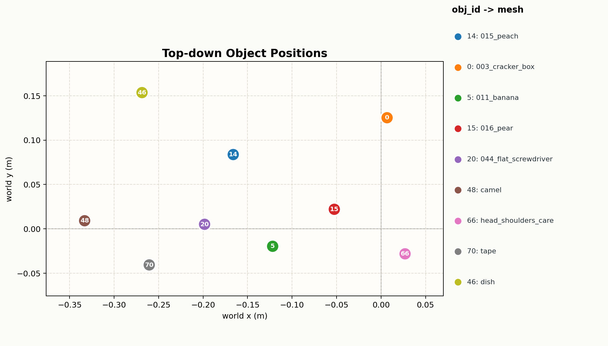

`annotations/` 是把物体模型、抓取标签和当前 RGB 帧对齐的关键桥梁。

## 6. rect_labels：场景帧级 2D 抓取矩形

`rect_labels/` 不在 `train_1/` 内部，而是顶层独立目录，按 `scene/camera/frame.npy` 组织。当前样例文件是：

```text
/home/zky-miakho/datas/rect_labels/scene_0000/kinect/0000.npy
```

每一行使用 GraspNet API 的 2D 矩形抓取格式：

```text
center_x, center_y, open_x, open_y, height, score, object_id
```

生成命令：

```bash
make vis-rect-labels
```

字段说明表：

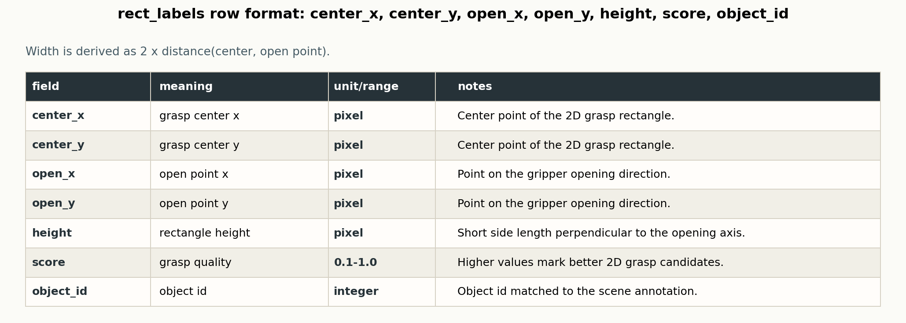

由于一帧里有大量矩形，全部画出来会遮挡图像。脚本默认从每个物体各选若干高分矩形做均衡展示：

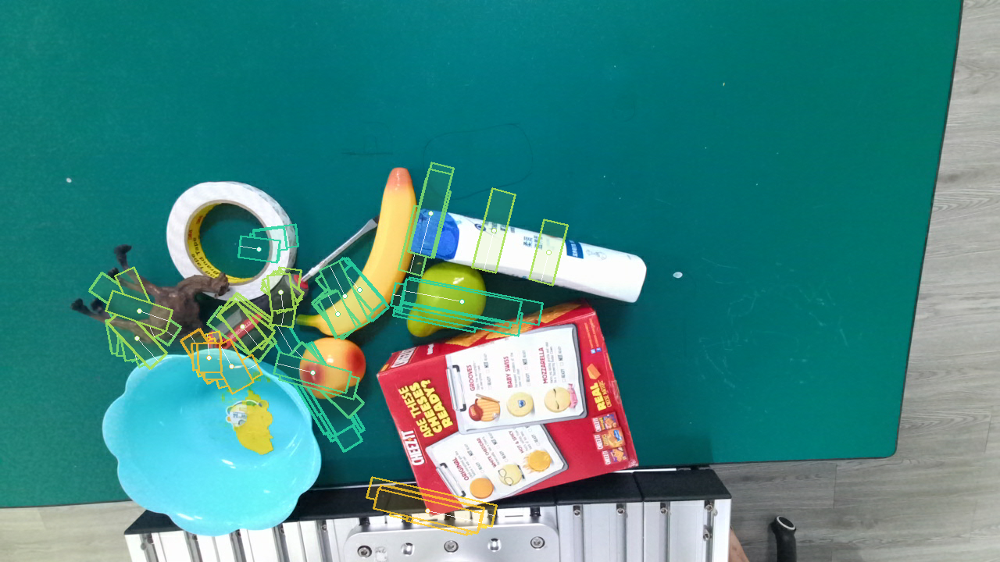

如果想只看全局最高分矩形，可以运行：

```bash
make vis-rect-labels RECT_SELECTION=top-score
```

## 7. grasp_label：物体级 3D 抓取标签

`grasp_label/` 是后续训练和推理更核心的标签。它不是按场景帧保存，而是按物体 id 保存。当前默认看桃子：

```text
/home/zky-miakho/datas/grasp_label/014_labels.npz
/home/zky-miakho/datas/models-xt19/models/014/nontextured_simplified.ply
```

生成命令：

```bash
make vis-grasp-label
```

### 7.1 文件结构

`014_labels.npz` 中的关键数组是：

```text
points     # 物体坐标系表面采样点，形状 N x 3
offsets    # 每个候选的 angle/depth/width，形状 N x 300 x 12 x 4 x 3
scores     # 抓取摩擦系数标签，形状 N x 300 x 12 x 4
collision  # 与 scores 同形状的布尔数组
```

核心维度可以理解为：

```text
N 个表面点 x 300 个方向 x 12 个平面内角度 x 4 个深度配置
```

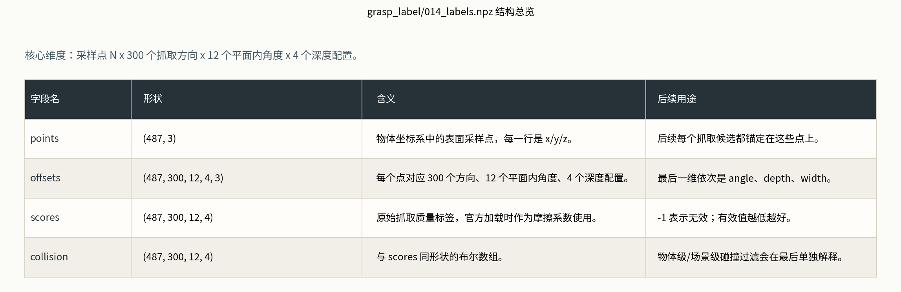

### 7.2 物体表面采样点

`points` 是物体坐标系中的采样点，不是当前相机看到的点云。图中用浅灰色真实物体模型作为背景，再叠加青色采样点，帮助理解这些点分布在物体的哪些位置。

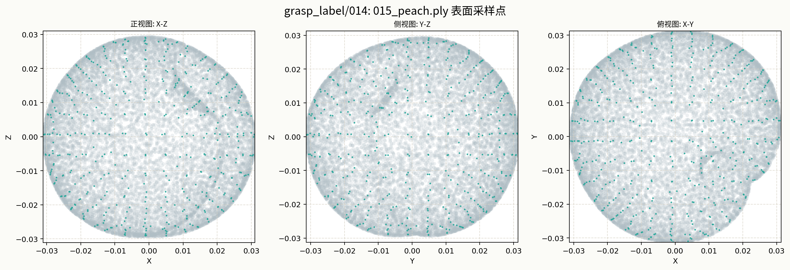

### 7.3 点级 graspness

为了先建立直觉，可以把每个点后面的 `300 x 12 x 4` 个候选聚合成点级 graspness：

```text
点级 graspness = 有效候选数量 / (300 x 12 x 4)
有效候选 = scores >= 0
```

颜色越亮，表示这个表面点附近存在更多有效抓取配置。

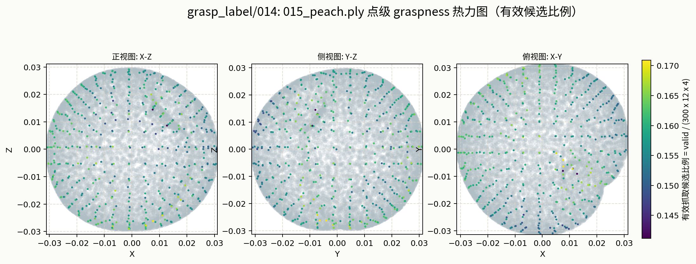

### 7.4 单点 300 个方向

脚本默认选择 graspness 最高的采样点，用红点标出，并从该点画出 300 条方向射线。射线颜色表示该方向下 `12 x 4` 配置中的最佳质量：

```text
quality = clip(1.1 - best_friction, 0, 1)
score = -1 表示无效
```

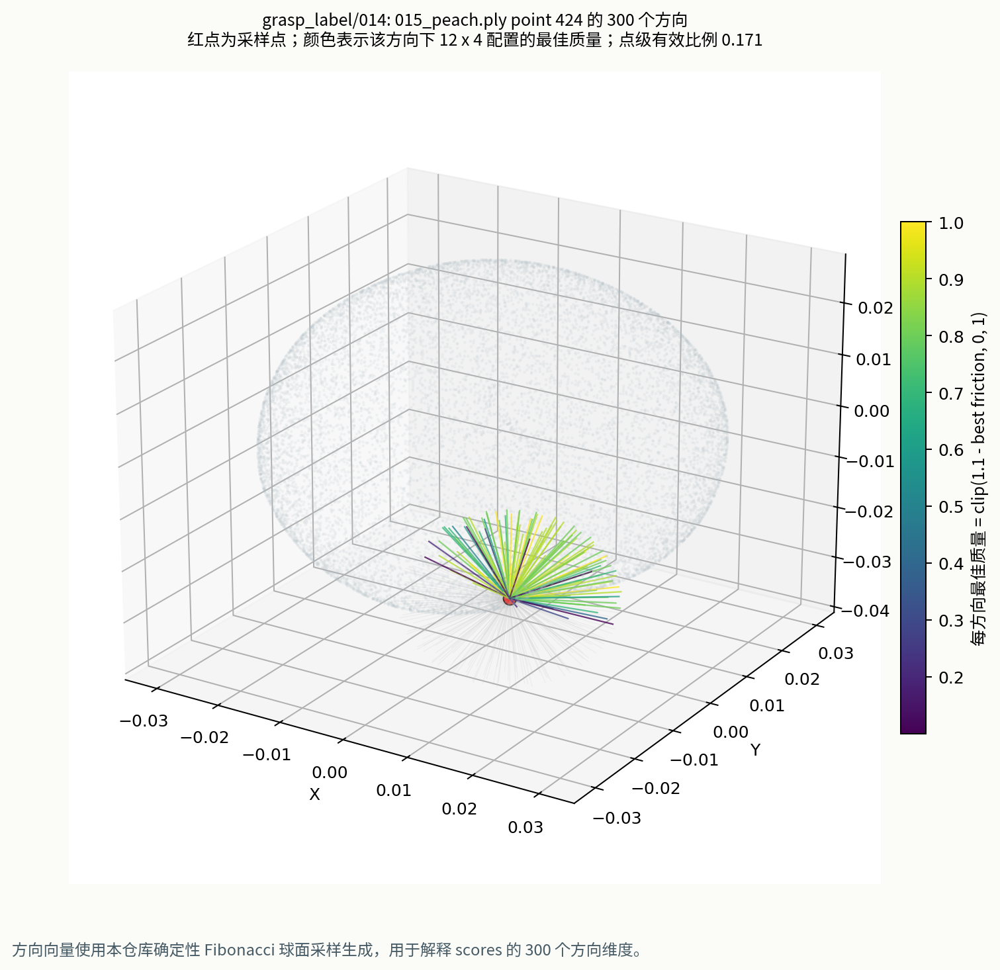

当前仓库用确定性的 Fibonacci 球面采样来解释 300 个方向维度。它适合做教学可视化，但如果要严格复现官方 GraspNet view ordering，需要替换为官方方向顺序。

### 7.5 一个方向下的 12 x 4 配置

固定一个点和一个方向后，再展开 `12 x 4`：

```text
12 = 夹爪绕 approach direction 的平面内旋转角度
4 = 沿 approach direction 的深度/接近距离配置
```

右侧热力图把 `scores[point, direction, angle, depth]` 展开成二维表，灰色表示无效，红框表示当前最佳配置。

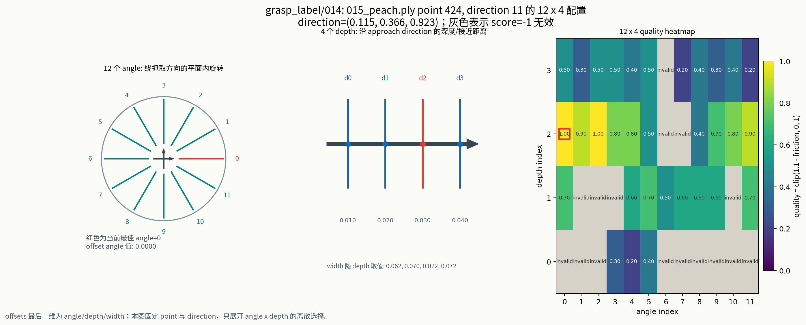

## 8. Top-K 3D 抓取投影到 RGB

前面的 `grasp_label/` 图都在物体坐标系中解释标签结构。为了回到真实图像，我们把高质量 3D 抓取候选通过 `annotations/` 和相机参数投影回当前 RGB 帧。

生成命令：

```bash
make vis-topk-3d-grasps
```

输出图：

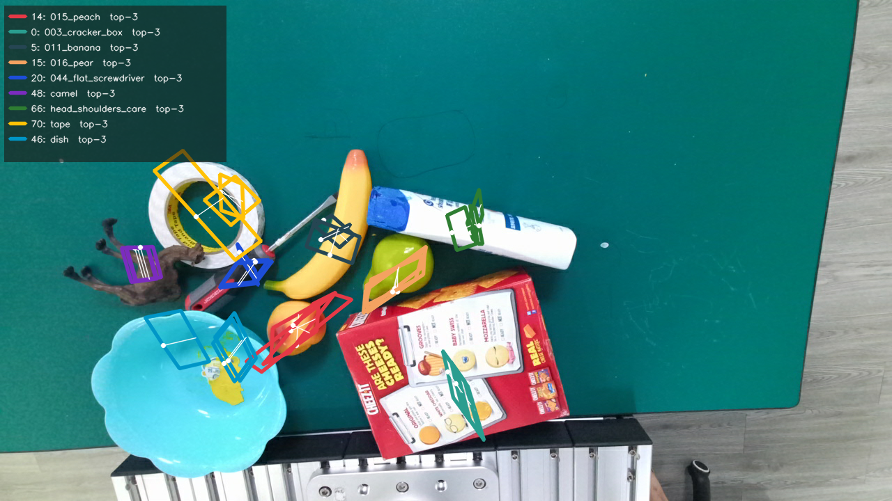

选择逻辑有两个重点：

```text
1. 先从 scores >= 0 的候选中按质量排序。
2. 同等质量下优先选择投影到当前物体 label mask 内的可见采样点。
```

第二点用于避免候选虽然质量高，但锚点落在当前视角不可见区域，导致夹爪看起来没有画在物体上。

## 9. collision_label：场景级碰撞过滤

`grasp_label/` 是物体级标签，同一个物体放到任何场景中都一样；`collision_label/` 是场景级标签，会告诉我们这些候选放进当前场景后是否会撞桌面、其他物体或场景点云。

当前样例文件是：

```text
/home/zky-miakho/datas/collision_label/scene_0000/collision_labels.npz
```

内部 key 是 `arr_0, arr_1, ...`，对应 `annotations/0000.xml` 中的物体顺序，而不是直接对应物体 id。每个数组形状与对应物体的 `grasp_label` 对齐：

```text
N x 300 x 12 x 4
True  = 碰撞
False = 不碰撞
```

训练或筛选时可以理解为：

```python
valid = scores >= 0
collision_free = ~collision
final_valid = valid & collision_free
```

生成命令：

```bash
make vis-collision-label
```

结构总览表列出每个 `arr_i` 与物体的对应关系、数组形状、碰撞比例和 collision-free 有效候选比例：

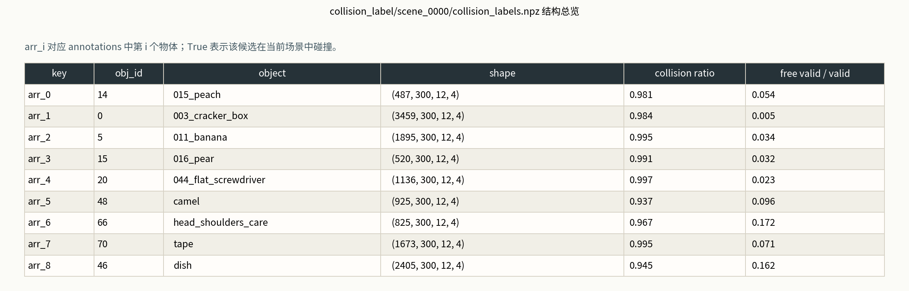

碰撞比例柱状图展示不同物体在当前场景中被过滤的程度：

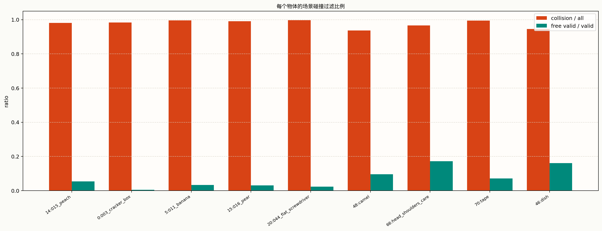

过滤前后 Top-K 对比图左侧只按质量选，右侧先要求 `collision=False` 再选：

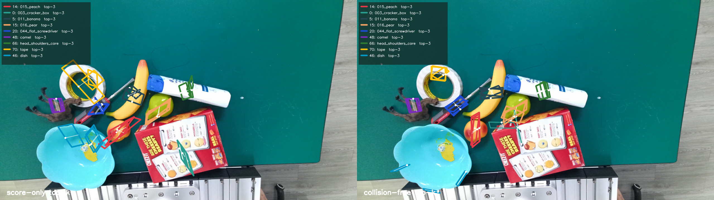

这里要注意：碰撞候选不会作为“高分正样本”训练；在当前可视化理解里，它们被过滤掉，相当于不能进入最终可用抓取集合。分数网络主要从 `scores` 中的有效候选学习质量，碰撞信息更像场景级可用性过滤。

## 10. 对踵分析：解释稳定抓取的几何直觉

对踵分析不是新的数据文件夹，而是继续解释 `grasp_label/` 中“为什么某些 3D 抓取更稳定”。当前仍然使用真实 `014_peach` 模型和 `014_labels.npz`。

生成命令：

```bash
make vis-antipodal
```

图中符号含义：

```text
绿色两点 = 两个接触点
绿色连线 = 两指之间的 opening/contact line
蓝色箭头 = 接触点附近估计出的局部表面法向
浅蓝锥体 = 简化摩擦锥
橙色箭头 = approach direction
```

第一张图把对踵概念直接画到真实桃子模型上：

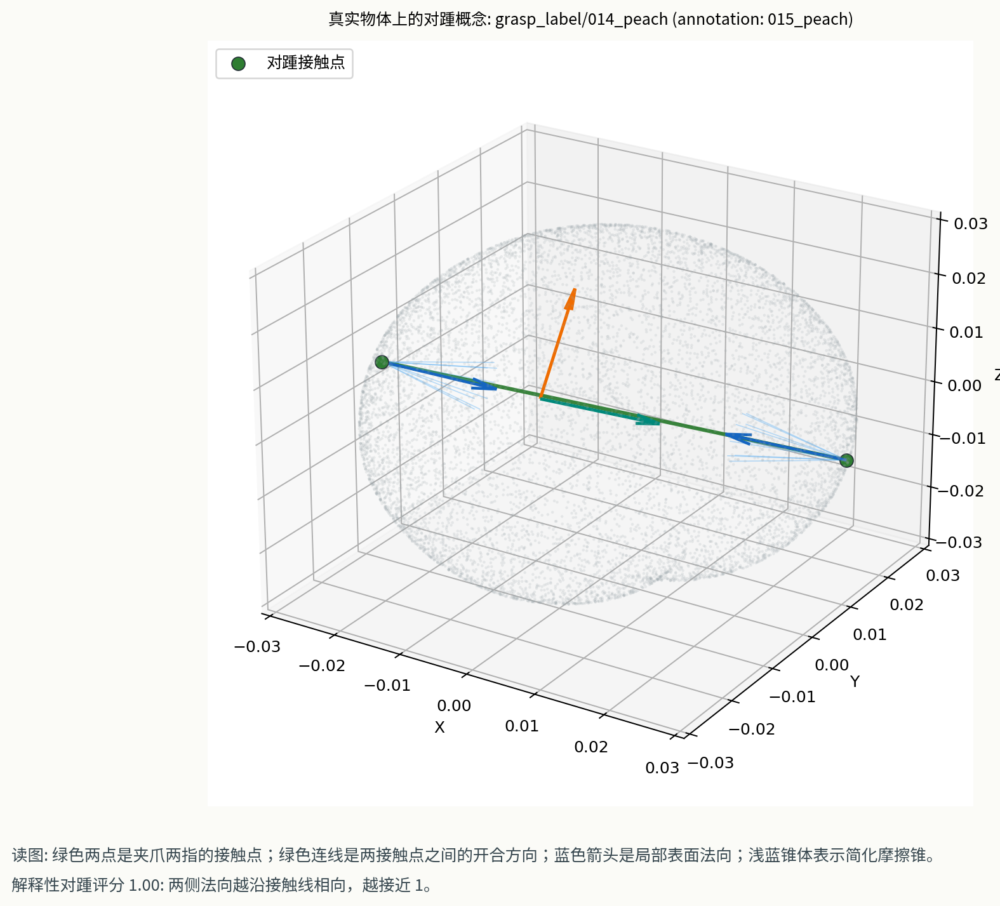

第二张图做正反例对比。好的对踵抓取像两根手指从物体两侧互相顶住；坏抓取虽然也有两个接触点，但力的方向没有形成稳定夹持。

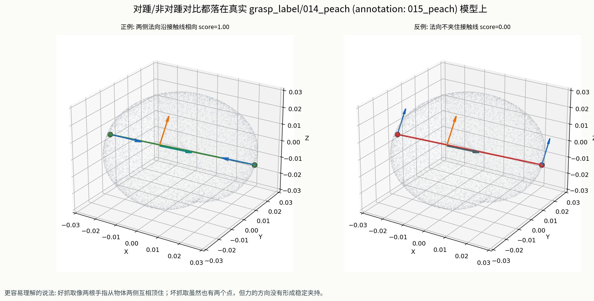

第三张图从 `014_labels.npz` 中选择一个高质量且接触分离清楚的代表候选，拆成接触点、opening axis、approach direction、局部法向和解释性对踵评分。

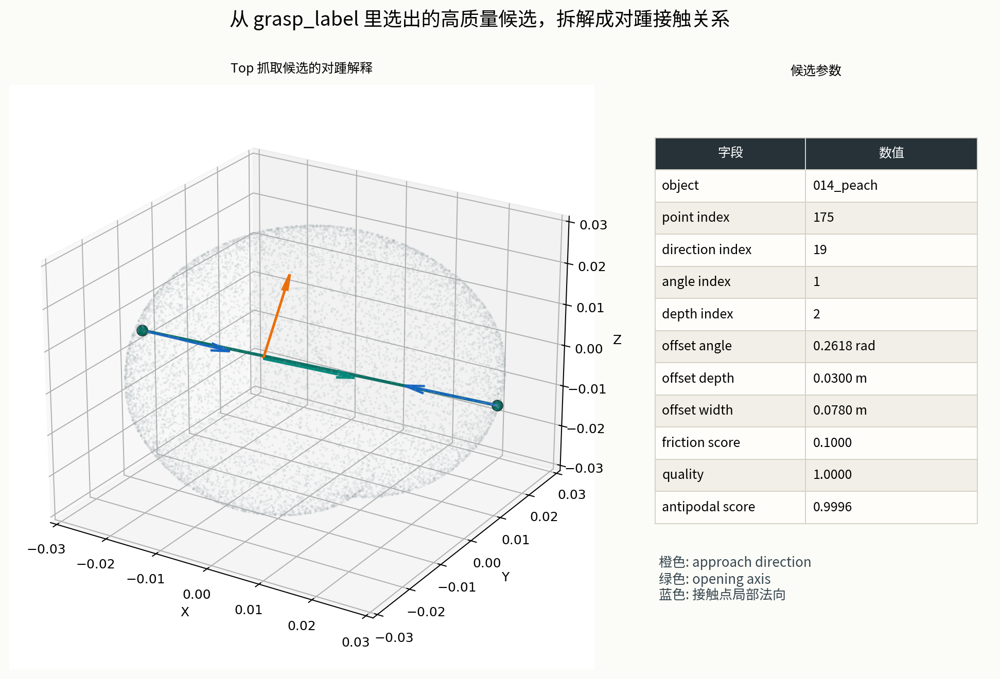

这里的对踵评分是解释性几何分数，用于汇报和理解，不等同于官方完整物理仿真或碰撞检测。最终可用抓取仍要结合 `scores >= 0` 和 `collision_label`。

## 代码结构

```text
visualization/
├── README.md                         # 当前图文探索报告
├── scripts/                          # 命令行入口，每类图一个脚本
├── src/                              # 可视化和数据读取逻辑
├── tests/                            # 单元测试与静态质量检查
└── outputs/scene_0000_kinect_0000/   # 当前样例输出图
```

主要模块：

```text
sample_paths.py                 # 统一管理样例输入/输出路径
rgb_visualization.py            # RGB 导出
depth_visualization.py          # depth 伪彩色和 Hamilton 编码
label_visualization.py          # label 颜色叠加
pointcloud_visualization.py     # RGB-D 点云和三视图预览
annotations_visualization.py    # annotations 表格和俯视图
pose_axes_visualization.py      # 物体位姿轴投影
rect_labels_visualization.py    # 2D 抓取矩形
grasp_label_visualization.py    # 物体级 3D 抓取标签
topk_grasp_overlay.py           # Top-K 3D 抓取投影到 RGB
collision_label_visualization.py # 场景级碰撞过滤
antipodal_analysis.py           # 真实物体上的对踵分析
```

## 验证

运行完整可视化测试：

```bash
python3 -m pytest visualization/tests -q
```

当前测试覆盖：路径构造、图像导出、深度编码/反解、点云生成、位姿投影、2D/3D 抓取标签解析、碰撞过滤、对踵分析，以及 `pyflakes` 静态质量检查。
